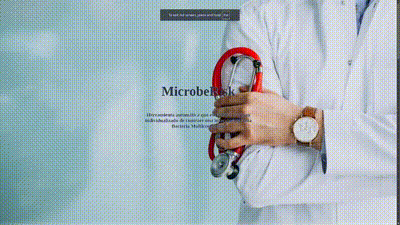

# MicrobeRisk - Innomakers4Health 2024

## Descripción del Proyecto

**MicrobeRisk** es una herramienta web diseñada para ayudar a los médicos a calcular el riesgo de que un paciente esté infectado con una bacteria multirresistente (BMR). Nuestro objetivo es proporcionar una solución que permita a los profesionales sanitarios adaptar el tratamiento antibiótico de manera más precisa, evitando el uso innecesario de antibióticos de amplio espectro y mejorando la gestión hospitalaria.

Este proyecto fue desarrollado durante el hackathon **Innomakers4Health 2024**, organizado por Pfizer y Wayra, y celebrado en 42Madrid el 18 y 19 de octubre de 2024. El evento se centró en crear soluciones innovadoras para combatir la multirresistencia a los antibióticos, un problema cada vez más preocupante en el ámbito de la salud.

<div align="center">
  
</div>

## Funcionalidades

- **Cálculo de Riesgo**: Herramienta que, tras introducir algunas variables, calcula la probabilidad de que un paciente esté infectado con una bacteria multirresistente.
- **Acceso Seguro**: Sección de login para que los médicos puedan acceder a la calculadora de riesgo de manera segura.
- **Interfaz Intuitiva**: Una experiencia de usuario optimizada con un diseño simple y eficaz.

## Tecnologías Utilizadas

- **Frontend**: HTML, CSS
- **Backend**: FastAPI (en proceso)
- **Base de Datos**: Archivos JSON

## Estructura del Proyecto

```bash
innomakers24/
│
├── css/
│   ├── calculator/
│   │   ├── footer.css
│   │   └── styles.css
│   └── main/
│       ├── footer.css
│       ├── header.css
│       └── styles.css
│
├── frontend/
│   ├── calculator.html
│   └── index.html
│
└── README.md
```

## Cómo Ejecutar el Proyecto

### Clona este repositorio:
```bash
git clone https://github.com/lgandarillas/innomakers24.git
```

### Abre el archivo frontend/index.html en tu navegador web ejecutando el siguiente comando en la consola:
```bash
google-chrome frontend/index.html
```

## Equipo
- Iván Aranguren Ripoll
- Álvaro Bravo Marqueño
- Carlos Bravo Garrán
- Luis Gandarillas Fernández
- Andrea López Salazar
- Jorge Melendo Córdoba

## Agradecimientos
A Pfizer, Wayra y 42Madrid por organizar este evento y por brindarnos la oportunidad de participar en esta experiencia única. Gracias también a los mentores y profesionales de la salud que nos ayudaron durante todo el hackathon.
